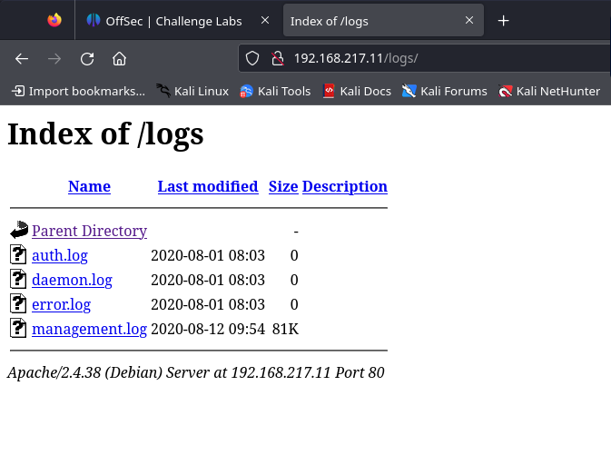

# DAWN

### I Curl the web page, but nothing special

***

    ┌──(hombresito㉿dope)-[~]
    └─$ curl 192.168.217.11                      
        <!DOCTYPE html>
        <html>
        <head>
            <body>
                         
                <h1>Website currently under construction, try again later.</h1>
                
In case you are suffering from any kind of inconvenience with your device provided by the corporation please contact with IT support as soon as possible, however, if you are not affiliated by any means with "Non-Existent Corporation and Associates" (NECA) <strong>LEAVE THIS SITE RIGHT NOW.</strong>

                

                <h3>Things we need to implement:</h3>
                <ul>
                <li>Install camera feeds.
                <li>Update our personal.
                <li>Install a control panel.
                </ul>
            </body>
        </head>
        </html>

***

### Then with nmap, I found 4 ports

***

    ┌──(hombresito㉿dope)-[~]
    └─$ nmap 192.168.217.11 
        Starting Nmap 7.94SVN ( https://nmap.org ) at 2024-04-26 02:44 HST
        Nmap scan report for 192.168.217.11
        Host is up (0.18s latency).
        Not shown: 996 closed tcp ports (conn-refused)
        PORT     STATE SERVICE
        80/tcp   open  http
        139/tcp  open  netbios-ssn
        445/tcp  open  microsoft-ds
        3306/tcp open  mysql

        Nmap done: 1 IP address (1 host up) scanned in 16.25 seconds

    ┌──(hombresito㉿dope)-[~]
    └─$ nmap -sC -sV -p80,139,445,3306 192.168.217.11
        Starting Nmap 7.94SVN ( https://nmap.org ) at 2024-04-26 02:45 HST
        Nmap scan report for 192.168.217.11
        Host is up (0.19s latency).

        PORT     STATE SERVICE     VERSION
        80/tcp   open  http        Apache httpd 2.4.38 ((Debian))
        |_http-server-header: Apache/2.4.38 (Debian)
        |_http-title: Site doesn't have a title (text/html).
        139/tcp  open  netbios-ssn Samba smbd 3.X - 4.X (workgroup: WORKGROUP)
        445/tcp  open  netbios-ssn Samba smbd 4.9.5-Debian (workgroup: WORKGROUP)
        3306/tcp open  mysql       MySQL 5.5.5-10.3.15-MariaDB-1
        | mysql-info: 
        |   Protocol: 10
        |   Version: 5.5.5-10.3.15-MariaDB-1
        |   Thread ID: 17
        |   Capabilities flags: 63486
        |   Some Capabilities: SupportsCompression, IgnoreSpaceBeforeParenthesis, Support41Auth, Speaks41ProtocolNew, SupportsLoadDataLocal, LongColumnFlag, SupportsTransactions, FoundRows, Speaks41ProtocolOld, ODBCClient, DontAllowDatabaseTableColumn, InteractiveClient, IgnoreSigpipes, ConnectWithDatabase, SupportsMultipleResults, SupportsMultipleStatments, SupportsAuthPlugins
        |   Status: Autocommit
        |   Salt: ~m%nz;Uz*\qD@QYJFa5&
        |_  Auth Plugin Name: mysql_native_password
        Service Info: Host: DAWN

        Host script results:
        |_clock-skew: mean: 1h20m00s, deviation: 2h18m35s, median: 0s
        | smb-security-mode: 
        |   account_used: guest
        |   authentication_level: user
        |   challenge_response: supported
        |_  message_signing: disabled (dangerous, but default)
        | smb2-security-mode: 
        |   3:1:1: 
        |_    Message signing enabled but not required
        | smb-os-discovery: 
        |   OS: Windows 6.1 (Samba 4.9.5-Debian)
        |   Computer name: dawn
        |   NetBIOS computer name: DAWN\x00
        |   Domain name: dawn
        |   FQDN: dawn.dawn
        |_  System time: 2024-04-26T08:45:43-04:00
        | smb2-time: 
        |   date: 2024-04-26T12:45:41
        |_  start_date: N/A

        Service detection performed. Please report any incorrect results at https://nmap.org/submit/ .
        Nmap done: 1 IP address (1 host up) scanned in 24.51 seconds

***

### Then using ffuf I found some webpages

***

    ┌──(hombresito㉿dope)-[~]
    └─$ ffuf -u http://192.168.217.11:80/FUZZ -w /usr/share/wordlists/seclists/Discovery/Web-Content/big.txt

            /'___\  /'___\           /'___\       
           /\ \__/ /\ \__/  __  __  /\ \__/       
           \ \ ,__\\ \ ,__\/\ \/\ \ \ \ ,__\      
            \ \ \_/ \ \ \_/\ \ \_\ \ \ \ \_/      
             \ \_\   \ \_\  \ \____/  \ \_\       
              \/_/    \/_/   \/___/    \/_/       

        v2.1.0-dev
    ________________________________________________

        :: Method           : GET
        :: URL              : http://192.168.217.11:80/FUZZ
        :: Wordlist         : FUZZ: /usr/share/wordlists/seclists/Discovery/Web-Content/big.txt
        :: Follow redirects : false
        :: Calibration      : false
        :: Timeout          : 10
        :: Threads          : 40
        :: Matcher          : Response status: 200-299,301,302,307,401,403,405,500
        ________________________________________________

        .htaccess               [Status: 403, Size: 298, Words: 22, Lines: 12, Duration: 193ms]
        .htpasswd               [Status: 403, Size: 298, Words: 22, Lines: 12, Duration: 192ms]
        cctv                    [Status: 301, Size: 315, Words: 20, Lines: 10, Duration: 184ms]
        logs                    [Status: 301, Size: 315, Words: 20, Lines: 10, Duration: 187ms]
        server-status           [Status: 403, Size: 302, Words: 22, Lines: 12, Duration: 185ms]
        :: Progress: [20476/20476] :: Job [1/1] :: 216 req/sec :: Duration: [0:01:55] :: Errors: 0 ::

***

### So upon visiting /logs dir there are quite some interesting files.

### So I downloaded the logs with wget

***

***
